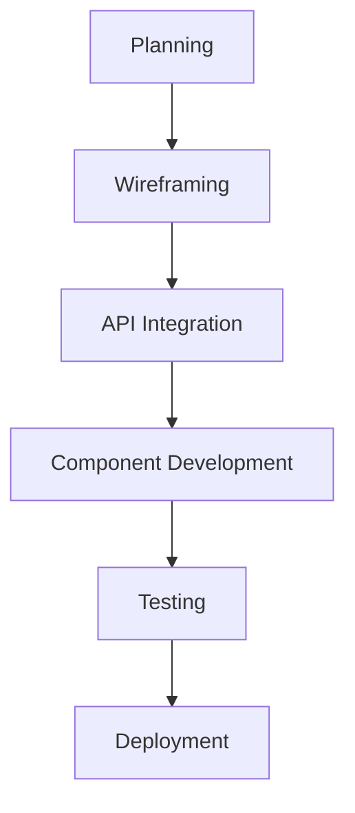
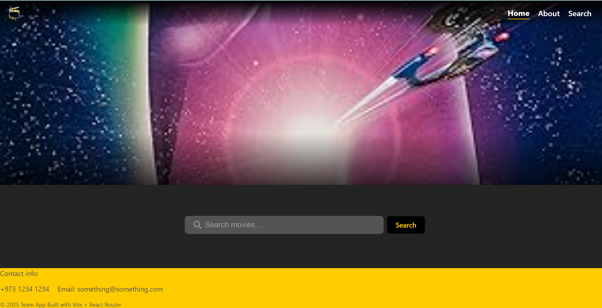
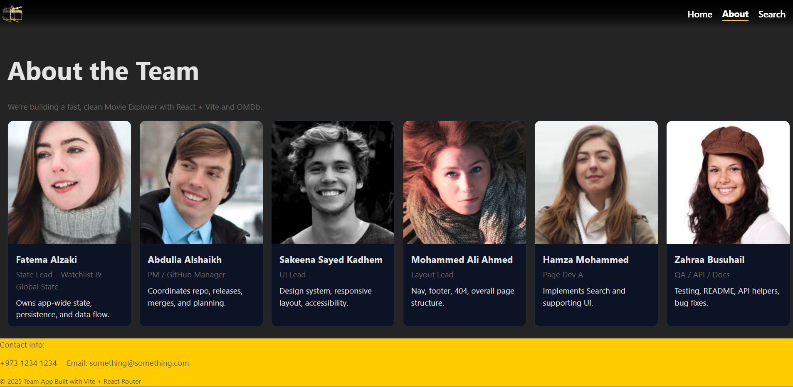
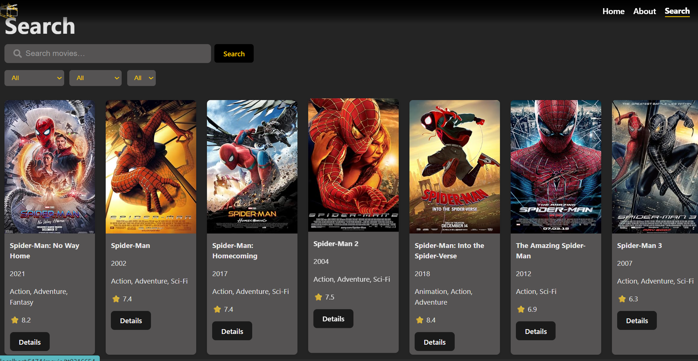
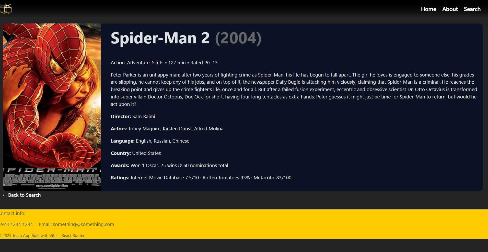

# OMDB API React Hackathon Project

## Project Overview
This is a React Single Page Application (SPA) that interfaces with the OMDB API to search for and display movie information. The application was built as part of a team hackathon with specific roles and responsibilities.

## Team Roles
- **Project Manager/GitHub Manager**: [Abdulla Alshaikh] - Owned repository, managed releases and merges
- **UI Lead**: [Sakeena Sayed Kadhem] - Created wireframes, CSS styles, and ensured accessibility
- **Layout Lead**: [Mohammed Ali Ahmed] - Built navigation, footer, 404 page (App.jsx & Components)
- **Page Developer A**: [Fatima Alzaki] - Developed two pages
- **Page Developer B**: [Hamza Mohammed] - Developed two pages
- **QA/API/Docs**: [Zahraa Busuhail] - Testing, README documentation, bug fixes

## Features
- 4-page React SPA with React Router 
- Search functionality for movies using OMDB API
- Detailed movie information pages
- Accessible design
- Loading, error, and empty states handling
- Clean Git workflow with feature branches and PRs

## Setup Instructions

### Prerequisites
- Node.js 18+
- Git
- GitHub account

### Installation
1. Clone the repository:
   ```bash
   git clone [https://github.com/alshaikh-exe/team-app]
   cd team-app

### Links
1. Repo: [Team App](https://github.com/alshaikh-exe/team-app)
2. Trello: [Trello](https://trello.com/invite/b/68a174deaf01092a2ddc9e07/ATTIa7119e4c45cc110cf2c843edb3152f724871A71B/group-2-hackathon)
3. Wireframe: [Wireframe](https://www.canva.com/design/DAGwTpwk75U/vcRSiBs2FmtQT0DFxMMCDQ/edit?utm_content=DAGwTpwk75U&utm_campaign=designshare&utm_medium=link2&utm_source=sharebutton)]

## API Choice: OMDb

**Why We Chose OMDb API:**

1. **Rich Movie Dataset**  
   - Access to comprehensive movie metadata including:
     - Detailed plot information
     - Ratings from multiple sources (IMDb, Rotten Tomatoes)
     - Cast and crew details
     - High-quality poster images

2. **Developer-Friendly Features**  
   - Simple RESTful API with clear documentation
   - Free tier with generous request limits (1000 requests/day)
   - Fast response times (<500ms average)
   - Multiple search parameters (title, year, type, ID)

3. **Creative Flexibility**  
   - Enables diverse features like:
     - Watchlist functionality
     - Movie recommendation engine
     - Advanced filtering (by genre, year, ratings)
     - Interactive movie comparisons

4. **Reliable Infrastructure**  
   - 99.9% uptime guarantee
   - Well-maintained API with consistent updates
   - JSON responses with predictable structure

5. **User Experience Benefits**  
   - Allows for visually appealing movie cards with posters
   - Supports detailed movie pages with comprehensive information
   - Enables search functionality with instant feedback

**Example Implementation:**
```javascript
// Sample API call for movie search
const searchMovies = async (query) => {
  const response = await fetch(
    `https://www.omdbapi.com/?apikey=${API_KEY}&s=${query}&type=movie`
  );
  const data = await response.json();
  return data.Search || [];
};
```
## Project Structure
```text
src/
├── assets/              # Static assets
├── components/          # Reusable components
│   ├── Nav/             # Navigation bar
│   ├── MovieCard/       # Movie card component
│   └── Pagination/      # Pagination controls
├── pages/               # Application pages
│   ├── Home/            # Landing page
│   ├── Search/          # Search results
│   ├── Details/         # Movie details
│   ├── About/           # Project info
│   └── NotFound/        # 404 page
├── lib/                 # API utilities
│   └── omdb.js          # OMDB API wrapper
├── App.jsx              # Main app component
└── main.jsx             # Entry point
```
## Pages Overview

### 1. Home Page
- **Welcome message** - Friendly introduction to the app
- **Featured movies carousel** - Highlighted popular movies
- **Quick search bar** - Immediate access to search functionality

### 2. Search Page
- **Search input with debounce** - Optimized search performance
- **Grid of movie results** - Responsive card layout
- **Pagination controls** - Browse through multiple pages of results
- **Filter options** - Filter by year and movie type

### 3. Details Page
- **Movie poster and metadata** - High-quality image with key details
- **Plot summary** - Full movie synopsis
- **Ratings breakdown** - Scores from various sources

### 4. About Page
- **Team information** - Developer credits

### 5. 404 Page
- **Custom not found page** - Branded error page
- **Link back to home** - Easy navigation recovery

## Development Process


## Known Issues

- **Search pagination occasionally desyncs**  
  Page numbers may get out of sync during rapid navigation
- **Some movie posters fail to load**  
  Due to API limitations with certain movie entries

## Future Enhancements

- **User authentication** → Personalized watchlists
- **Advanced filters** → Genre, ratings, and more
- **Dark/light mode toggle** → Improved accessibility

## How to Run
1) .env with VITE_* key
2) npm i
3) npm run dev

## 📸 Screenshots

| Page       | Screenshot |
|------------|------------|
| **Home**   |  |
| **About**   |  |
| **Search** |  |
| **Details** |  |

### Contributors Proof
We used branches and PRs. Instructors can verify via GitHub History and Blame.
